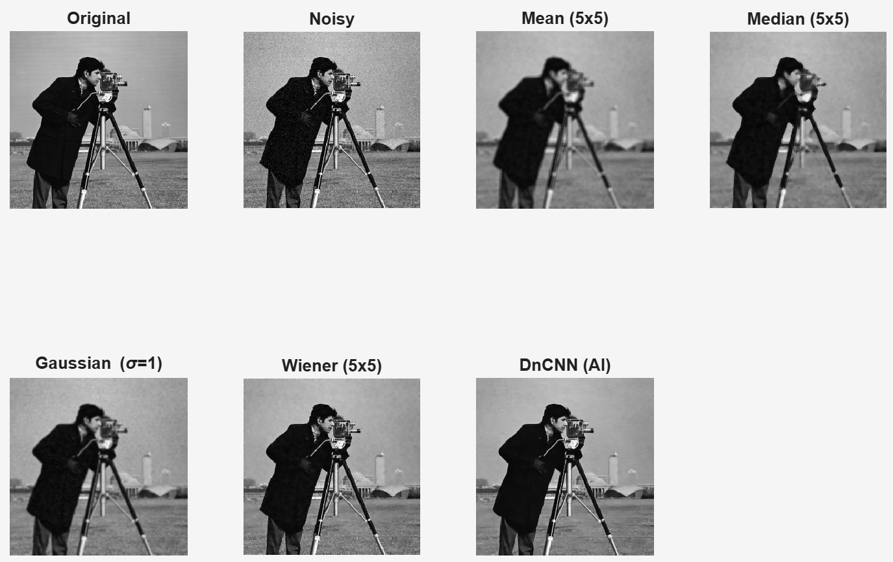

## Updated README.md with Embedded Image ##

This repository contains a **complete MATLAB solution** for modeling Gaussian noise in images and comparing **traditional filters** vs. a **state-of-the-art deep learning model (DnCNN)**.

---

## Assignment Objectives

1. **Model Gaussian noise** in MATLAB
2. **Measure quality** using:
   - Mean Squared Error (MSE)
   - Peak Signal-to-Noise Ratio (PSNR)
   - Structural Similarity Index (SSIM)
3. **Compare** traditional filters (Mean, Median, Gaussian, Wiener) vs. **AI (DnCNN)**

---

## Visual Results



> **From left to right, top to bottom:**  
> Original → Noisy → Mean → Median → Gaussian → Wiener → **DnCNN (Best)**

---

## Quantitative Results (σ = 0.04)

| Method           | MSE      | PSNR (dB) | SSIM   |
|------------------|----------|-----------|--------|
| Noisy Image      | 0.00160  | 26.98     | 0.5390 |
| Mean Filter      | 0.00094  | 29.29     | 0.7431 |
| Median Filter    | 0.00078  | 30.11     | 0.7945 |
| Gaussian Blur    | 0.00089  | 29.53     | 0.7523 |
| Wiener Filter    | 0.00052  | 31.89     | 0.8662 |
| **DnCNN (AI)**   | **0.00027** | **35.71** | **0.9431** |

> **DnCNN achieves ~9 dB higher PSNR** than traditional methods.

---

## How to Run

### Requirements
- MATLAB R2020b+
- **Image Processing Toolbox**
- **Deep Learning Toolbox**

### Steps
1. Clone the repo:
   ```bash
   git clone https://github.com/HammadKhalid75/Lab7.git
   cd gaussian-denoising-comparison

Run in MATLAB:matlabrun('denoising_comparison.m')
Output:
Figure window + console metrics
results/comparison.png (auto-saved)


## Repository Structure ##
├── denoising_comparison.m     Main script
├── cameraman.tif             Test image
├── results/
│   └── comparison.png        Visual output
├── README.md
└── LICENSE
